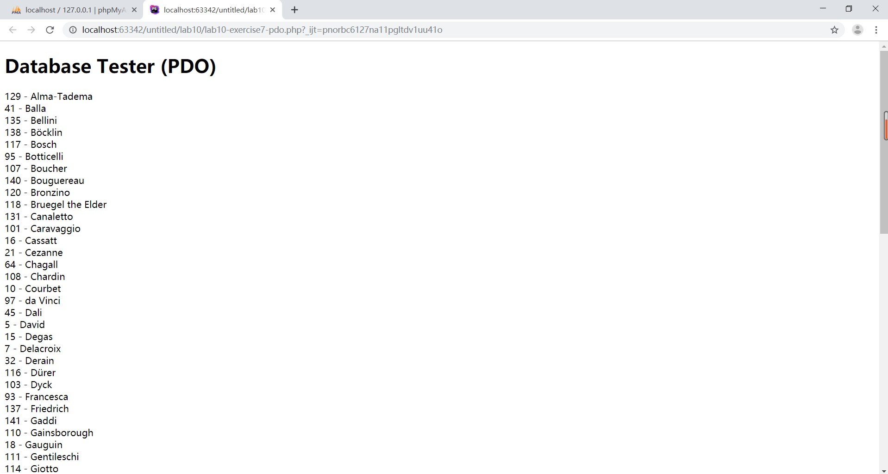
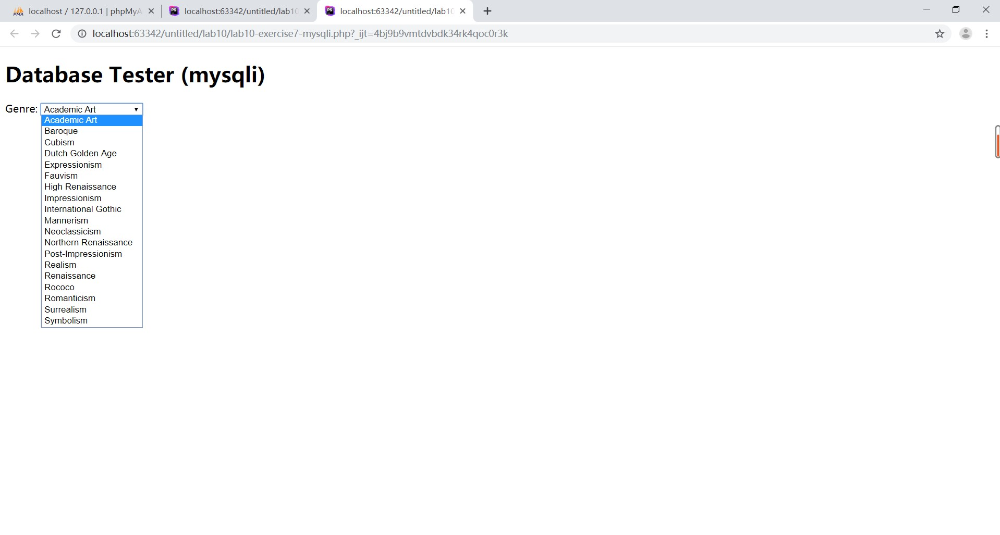
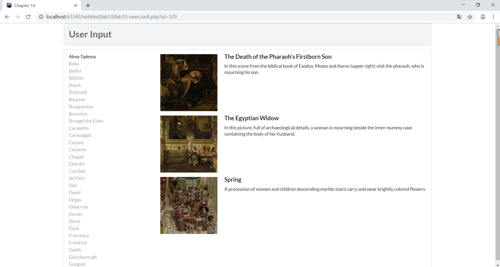
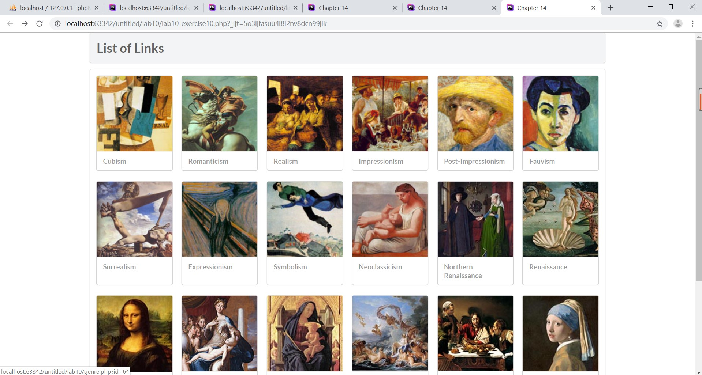

# Lab10文档

姓名：邰荟媛 

学号：19302010077
  
## Exercise7   

### pdo

#### 截图

#### 代码解释

初始化一个PDO对象，设置属性错误报告，抛出exceptions异常

执行 SQL 语句，返回结果集。每次从结果集中获取下一行，输出ArtistID和LastName

### mysqli

#### 截图

#### 代码解释

打开一个到 MySQL 服务器的新的连接，若有错误进行错误处理

针对数据库进行查询，从结果集中取得一行作为关联数组，输出选项

释放结果内存，关闭先前打开的数据库连接

## Exercise8

#### 截图

#### 代码解释

##### outputArtists

初始化一个PDO对象，设置属性错误报告，抛出exceptions异常

执行 SQL 语句，返回结果集。每次从结果集中获取下一行，输出LastName,设置超链接，点击后可显示id查询字符串中指定的艺术家id的绘画列表

##### outputPaintings

初始化一个PDO对象，设置属性错误报告，抛出exceptions异常

执行 SQL 语句，id查询字符串中指定的艺术家id的绘画列表，返回结果集。每次从结果集中获取下一行，显示painting信息

##### outputSinglePainting

显示图片以及Title、Excerpt

## Exercise9

#### 截图

#### 执行sql语句的方式

1.使用executeUpdate或者使用executeLargeUpdate方法来执行DDL和DML语句

2.使用execute方法执行SQL语句

3.使用PreparedStatement执行SQL语句

4.使用CallableStatement调用存储过程

#### the advantage of using Prepared Statements

1.PreparedStatement预编译SQL语句，性能更好

2.PreparedStatement无须“拼接”SQL语句，编程更简单

3.PreparedStatement可以防止SQL注入，安全性更好

## Exercise10

#### 截图

#### 代码解释

##### outputGenres —— Displays a list of genres

初始化一个PDO对象，设置属性错误报告，抛出exceptions异常

执行 SQL 语句，返回结果集。每次从结果集中获取下一行，调用outputSingleGenre输出genre

##### outputSingleGenre —— Displays a single genre

显示图片，在图片和名字上调用constructGenreLink构造链接

##### constructGenreLink —— Constructs a link given the genre id and a label (which could be a name or even an image tag）

构造超链接连接到genre.php，获得参数变量id=GenreId，即可跳转