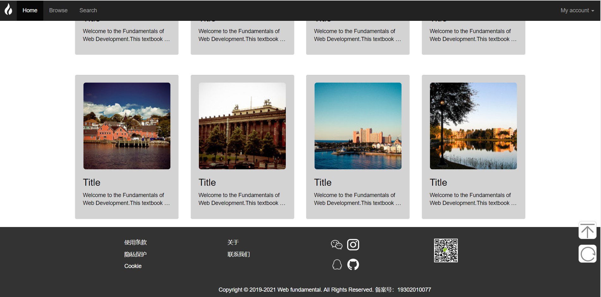

LAB 4 设计文档
==========

## 布局

### 导航栏

向`nav`标签添加class .navbar；向`div`元素添加class .navbar-header，内部包含了带有 class navbar-brand的`a`元素；再添加带有 class .nav、.navbar-nav 的无序列表，从而采用了Bootstrap的**默认导航栏**设计。

在 class .dropdown 内加上下拉菜单，从而采用Bootstrap的**下拉菜单**设计。

同时运用了Bootstrap的**响应式导航栏**，将导航栏内容包裹在带有class .collapse .navbar-collapse的`div`中。三个带有 class .icon-bar 的`span`创建所谓的汉堡按钮,这些会切换为 .navbar-collapse`div`中的元素。

运用Bootstrap中的.navbar-fixed-top将导航栏固定在顶部.navbar-inverse将导航栏改为黑色背景。

### 轮播

这里采用了Bootstrap的**轮播插件**（Carousel），分为轮播指标、轮播项目、轮播内容三个部分。

### 图片展示

图片展示部分采用了Bootstrap的**网格系统**，通过一系列包含内容的行和列来分布图片。每张图片及其描述都放在Bootstrap的well中。

图片采用了Bootstrap图片的**圆角**（.img-rounded）、**响应式**（.img-responsive）、**中间布局**（.center-block）。

文本部分标题用`h3`将标题与描述区分开，描述用了Bootstrap的.text-left来分布，溢出两行则显示省略号在index.css中设置。

### 页脚

页脚部分也采用了Bootstrap的**网格系统**来排布联系方式等内容

### 辅助图标

辅助图标在index.css中实现

-----------------

## 作业效果图

