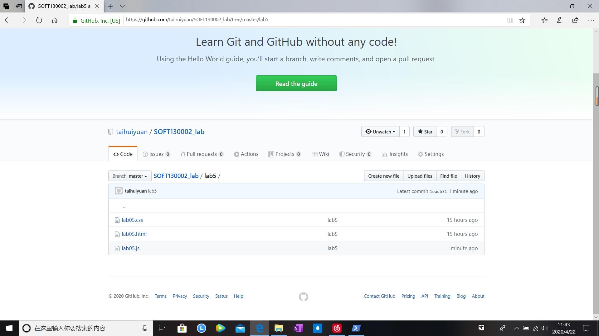
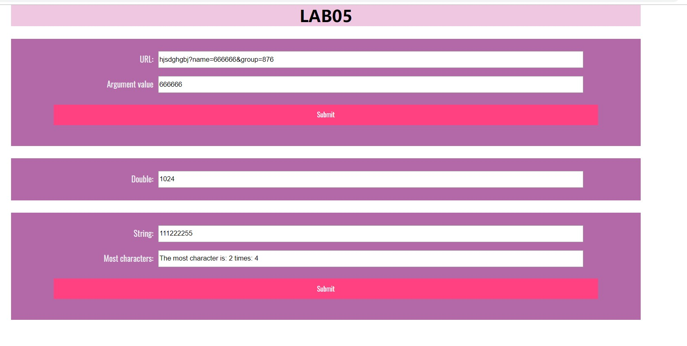

# Lab5设计文档
姓名：邰荟媛

学号：19302010077

## 函数相关知识点

1、字符数组处理函数

2、设置时间函数

3、对象

## 解决方案

1、用indexOf()、substring()提取子字符串

2、用getSeconds()得到当前秒数，用setInterval()、clearInterval()设置取消定时装置

3、用对象存储每一个字符，判断字符出现次数，再遍历对象，找出最大的次数

## 截图

### github截图

### 网页效果截图

