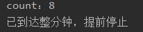
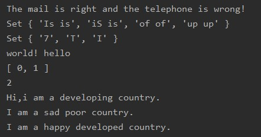

# Lab6设计文档

姓名：邰荟媛

学号：19302010077

## 各个正则表达式的解释

### 手机电话

正则表达式：/^1\d{10}$/

解释：使用“^”匹配邮箱的开始部分，用“$”匹配邮箱结束部分以保证手机号码前后不能有其他字符;1表示以1开头，/d表示任何ASCII数字，{10}表示匹配前一项10次

### 邮箱

正则表达式：/^[a-zA-Z0-9_-]+@[a-zA-Z0-9_-]+(\ .[a-zA-Z0-9_-]+)+$/

解释：

邮件名称部分：26个大小写英文字母表示为a-zA-Z；数字表示为0-9；下划线表示为_；中划线表示为-；用+表示多次出现

域名部分：域名类似“** .** .** .** ”组成，“.** ”部分可以表示为\ .[a-zA-Z0-9_-]+，多个“.** ”可以表示为(\ .[a-zA-Z0-9_-]+)+

需要使用“^”匹配邮箱的开始部分，用“$”匹配邮箱结束部分以保证邮箱前后不能有其他字符

### 找相邻重复单词

正则表达式：/\b([a-z]+) \1\b/i

解释：\b是匹配一个单词的边界；([a-z]+)是匹配一个到多个小写字母；\1是引用第一个括号的内容；/i不区分大小写

## 继承不同方式的理解

### 构造函数

基本思想是在子类构造函数内部调用父类构造函数，本质是在子类实例中创建了父类属性

问题：父类实例方法无法被复用；父类原型中的属性和方法对子类不可见，因此无法同时使用构造和原型

### 原型链

本质是将子类的原型设为父类的实例

问题：父类中的实例属性会成为子类的原型属性；无法在不影响所有子类实例情况下向父类构造函数传参

### Object.create原型式继承

基本思想是基于对象的继承，本质上是做了已有对象的浅复制（即不会重新创建引用类型的新实例）

问题：因为是浅复制，所以初始对象中的引用类型属性会被所有副本共享

## Map、Set、Array之间的区别与使用

### Map

类似于对象的键值对有序列表，但其键可以是任意类型的；可以用new关键字创建

### Set

类似于数组的有序列表，但成员值都是唯一的；可以使用new关键字创建；其size属性提供了成员个数

### Array

数组对象，是使用单独的变量名来存储一系列的值。可以使用new关键字方式创建数组

## 截图

### github截图

### 本地命令行截图

